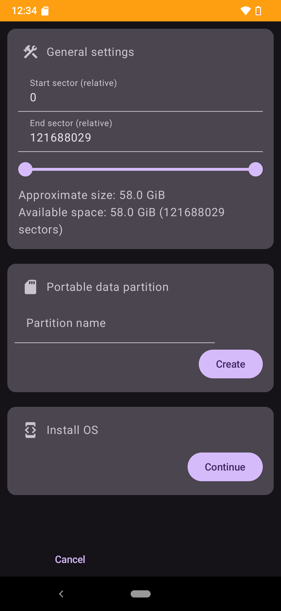
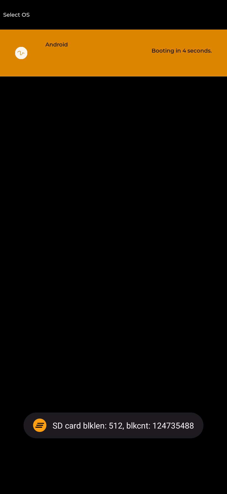
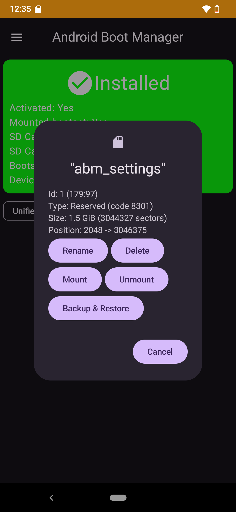
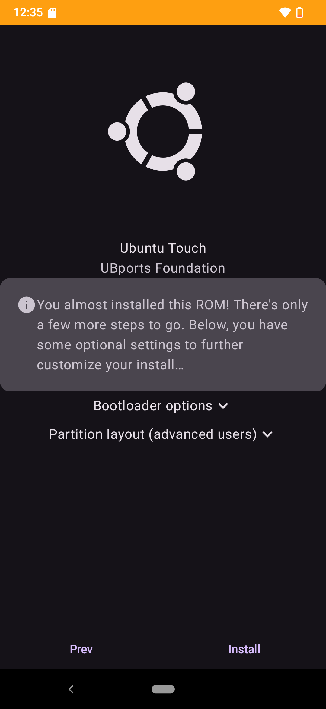
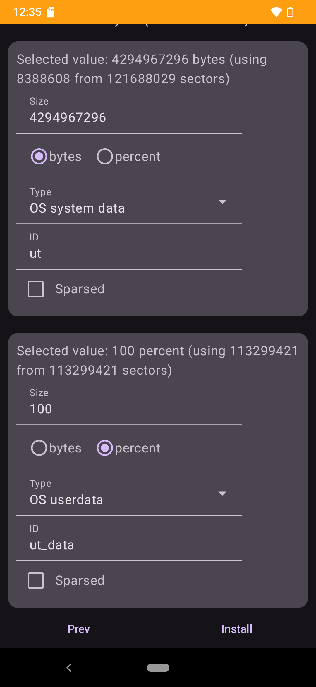
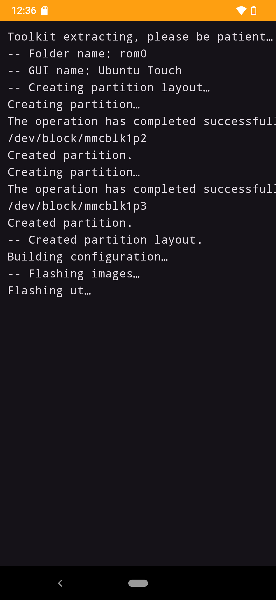

<h1 align="center">
  
   Android Boot Manager  
</h1>

  

**Multi-boot for smartphones!**

## What is it?

Android Boot Manager is an Android app and a couple of bootloader modifications, which are all based
on a library called droidboot_gui. Additionally, there are scripts that automate patching operating
systems created by third parties to work in the multi-boot environment.

The Android app is the configuration frontend which oversees installing and updating operating
systems, partitioning the storage and installing and configuring the bootloader modifications.

The bootloader modifications are responsible for showing a graphical selection UI at boot time that
lets you select the operating system you intend to start. There are three types of supported
bootloaders:
1. First-stage bootloader modifications, which means you modify/replace the bootloader that would
   usually start the Linux kernel. We prefer this.
2. Creating or porting a second-stage bootloader, which will be loaded instead of the kernel and
   later loading the kernel from the second-stage bootloader. This is also good.
3. The "no-bootloader workaround ramdisk", which runs inside the kernel and flashes the boot the
   user wants to boot, then reboots the device. This is really just a workaround.

(A solution akin to MultiROM's kexec-hardboot would also be possible, however, we currently aren't
pursuing this.)

The scripts and device configuration files for the App are stored in the
[Scripts](https://github.com/Android-Boot-Manager/Scripts) and
[ABM-json](https://github.com/Android-Boot-Manager/ABM-json/tree/master/devices) repositories.
These are intended to be very flexible and support many devices without changing the App code,
at least not unless we release a major new feature. The operating systems are usually created by
other communities and we only modify them to work in a multi-boot setup. Right now, Halium-based
operating systems like [UBports' Ubuntu Touch](https://ubuntu-touch.io/) or
[Droidian](https://droidian.org/) are supported best. We also support
[SailfishOS](https://sailfishos.org/), and we are working on installing multiple Android systems as
well.

## What devices are supported?

1. First-stage bootloaders
    - MediaTek lk
      - [Volla Phone (yggdrasil)](https://github.com/Android-Boot-Manager/droidboot_device_volla_yggdrasil) - MT6763
      - Volla Phone X (yggdrasilx) - MT6763
      - [Volla Phone 22 (mimameid)](https://github.com/Android-Boot-Manager/droidboot_device_volla_mimameid) - MT6768
      - [Volla Phone X23 (vidofnir)](https://github.com/Android-Boot-Manager/droidboot_device_gigaset_gx4) - MT6789
    - [U-Boot](https://github.com/Android-Boot-Manager/droidboot_device_generic_u-boot)
    - Qualcomm ABL EFI LinuxLoader
      - [F(x)tec Pro1](https://github.com/Android-Boot-Manager/droidboot_device_fxtec_pro1) - not ported to 0.3 yet
2. Second-stage bootloaders
    - [Project Renegade's EDKII for MSM](https://github.com/Android-Boot-Manager/droidboot_device_renegade-uefi)
    - [lk2nd](https://github.com/Android-Boot-Manager/droidboot_device_qcom_lk2nd)

## How do I install it?
You need a rooted and supported device to get started. The detailed instructions can be found on our
[MediaWiki instance](https://wiki.andbootmgr.org).

## Why?
Why not?

## Screenshots
|  |  |  |
|-------------------------------------------------|-------------------------------------------------|-------------------------------------------------|
|  |  |  |

## Credits
- [M1cha](https://github.com/M1cha) for efidroid, arguably the best approach for multi-booting
- [Mis012](https://github.com/Mis012) for re-boot2, which we borrowed some code from
- [msm8916-mainline](https://github.com/msm8916-mainline) and [msm8953-mainline](https://github.com/msm8953-mainline) for lk2nd
- [Renegade Project](https://github.com/edk2-porting) for edk2-msm
- [U-Boot team](https://u-boot.org)
- [Volla](https://volla.online)
- [BigfootACA](https://github.com/BigfootACA) for SimpleInit
- [calebccff](https://github.com/calebccff)
